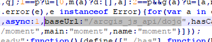

# 焉耆项目
## 获取代码
```
git clone https://github.com/guzhongren/YanqiProject.git
```
## 运行代码
1. 安装依赖
```
yarn install
```
2. 打包通用代码及样式
```shell
yarn run vendor
```
3. 开发环境运行
```
yarn run dev
```
### ***命令之后要将dist/fa目录移动至dist/css/下, 此bug稍后再改***

## 配置ags api

在[官网](https://developers.arcgis.com/javascript/latest/guide/get-api/index.html)下载4.X版本的API,解压后将4.X目录下的所有文件拷贝至public/arcgis_js_api目录下；按照官方文档修改init.js和dojo.js中的路径，本文修改如下
将
```
[HOSTNAME_AND_PATH_TO_JSAPI]
```
替换为
```
/arcgis_js_api/
```
结果显示如下



